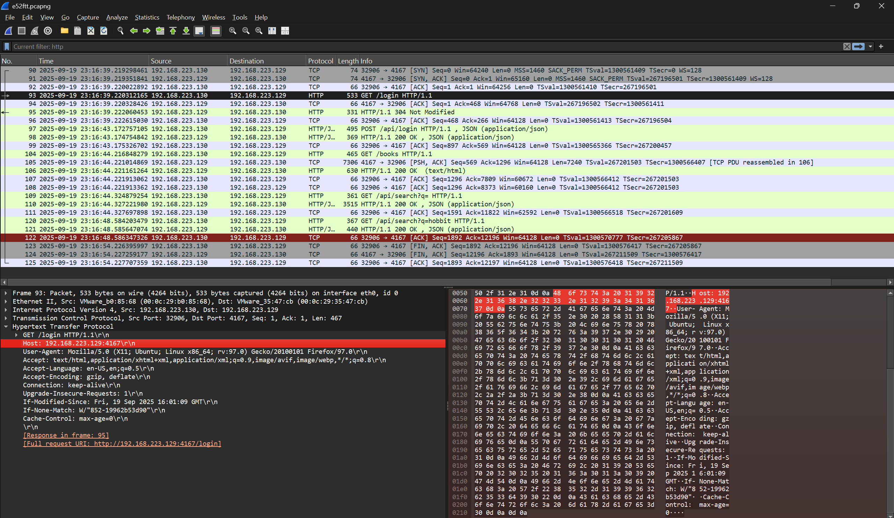

# Quiz-Network-Traffic-Analysis

## Member

| Nama                      | NRP        |
| ------------------------- | ---------- |
| Wildan Alfarezy       | 5027251088 |
| Muhammad Yusuf | 5027251067 |

## Laporan

1. What is the IP and Port of the web server? 

jawaban: IP 192.168.223.129 port 4167

Gunakan filter di wireshark dengan mengetik `http` lalu kami cari paket dengan tulisan `Get/login` dari situ kami bisa mendapatkan `host` yang berisikan `ip` beserta `port` web servernya di bagian hypertext transfer protocol. 

jadi suatu browser itu meminta halaman web, browser diwajibkan untuk mengirim informasi bernama `Host` yang berisi alamat tujuan. jadi dari situ kamii bisa tau bahwa apa pun yang tertulis di `Host` adalah alamat `IP (atau domain)` dan `Port` dari web server yang sedang diakses.

3. Which user logged in on Sep 19, 2025 23:17:44 (GMT+7)?

