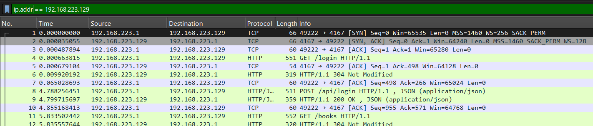
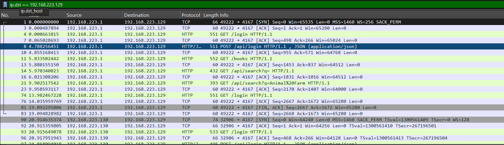
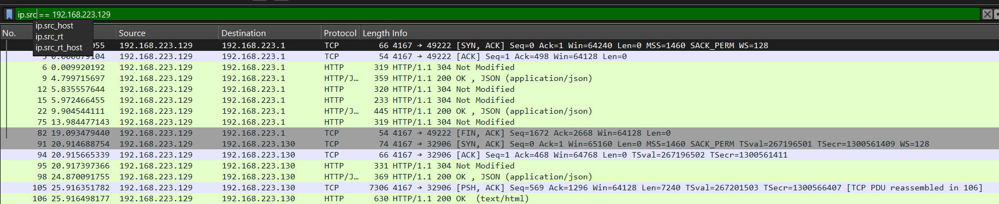
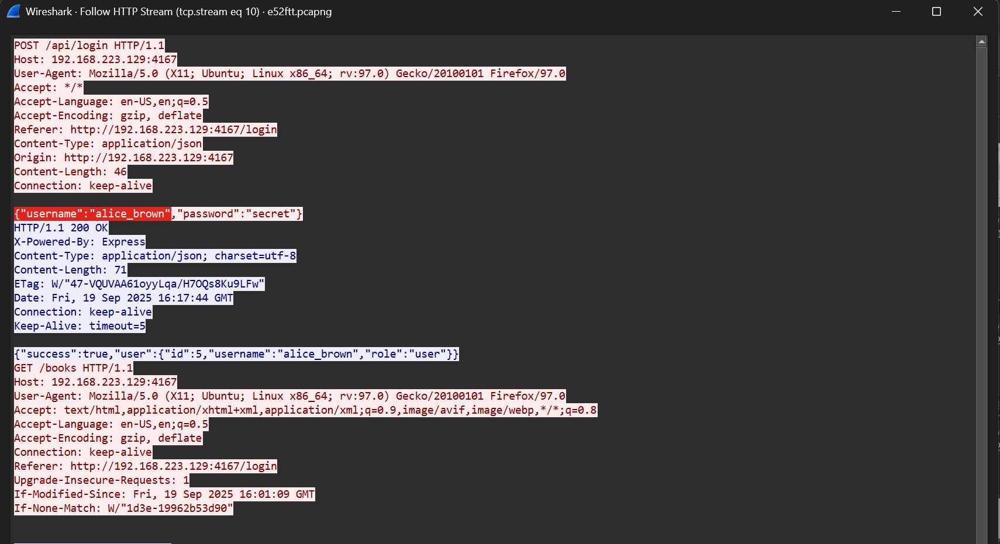
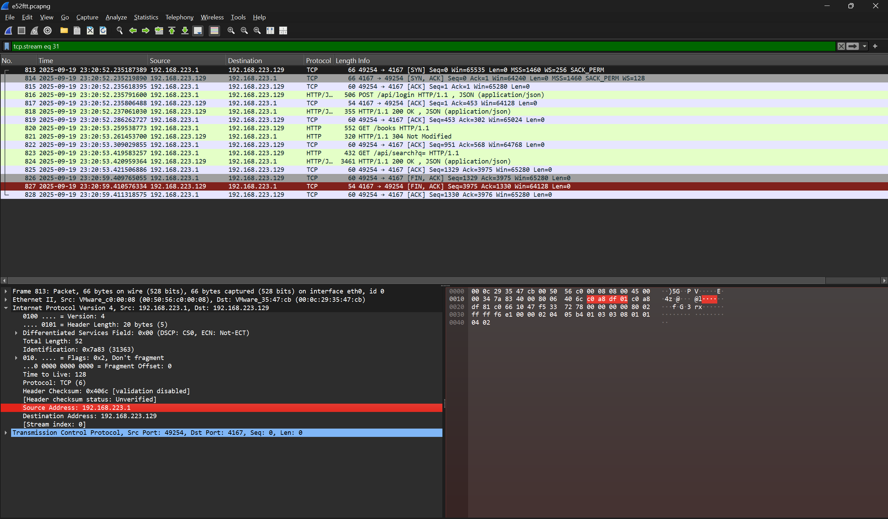
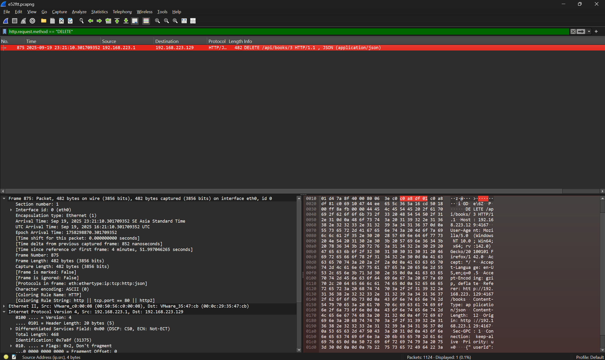
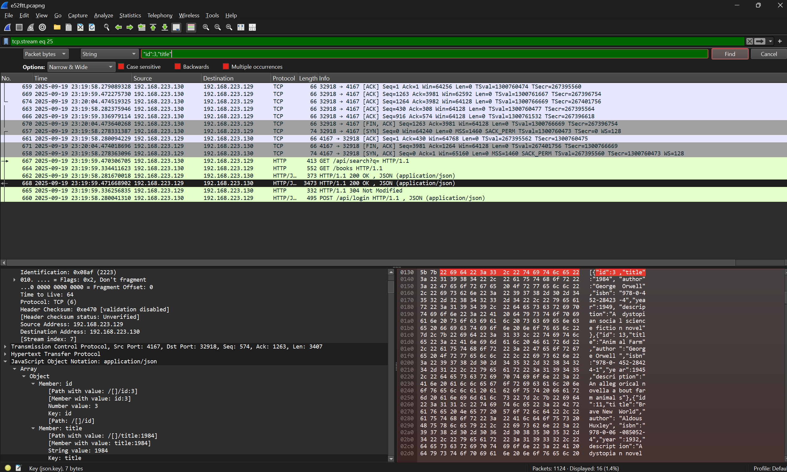
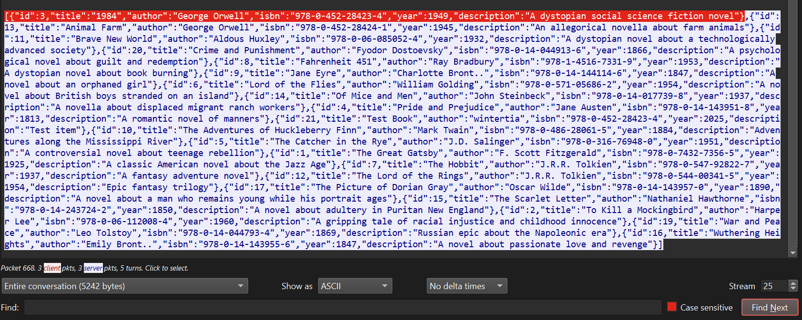
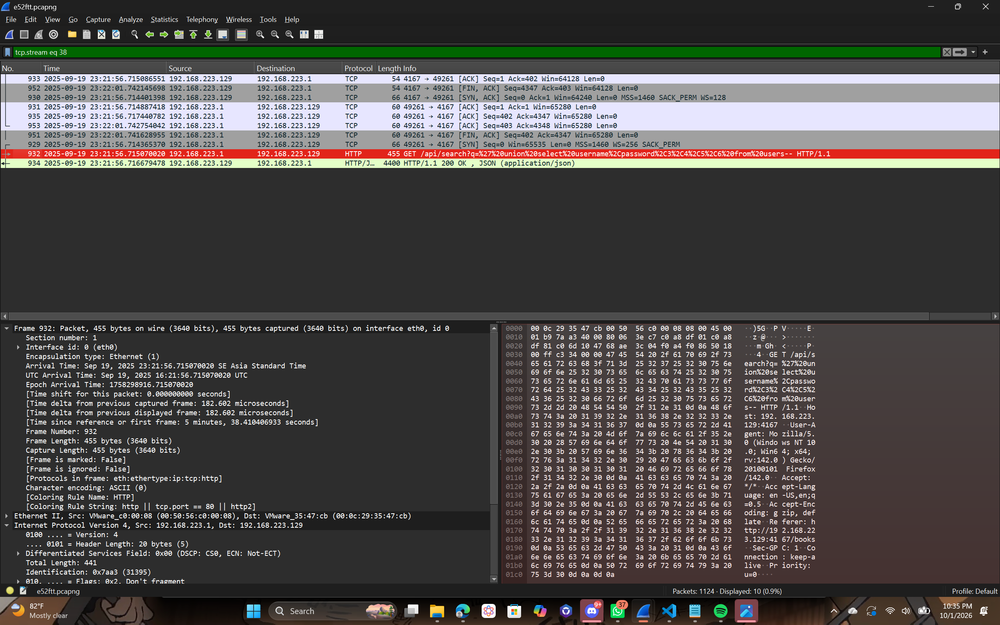
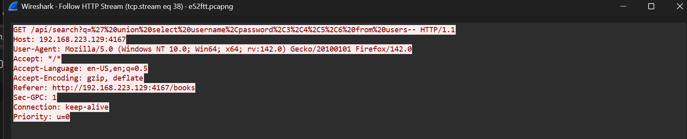

# Quiz-Network-Traffic-Analysis

## Kelompok 15

## Anggota

| Nama                      | NRP        |
| ------------------------- | ---------- |
| Wildan Alfarezy       | 5027251088 |
| Muhammad Yusuf | 5027251067 |

## Laporan (Soal No 2)

1. What is the IP and Port of the web server? 

jawaban: IP 192.168.223.129 port 4167

Gunakan filter di wireshark dengan mengetik `http` lalu kami cari paket dengan tulisan `Get/login` dari situ kami bisa mendapatkan `host` yang berisikan `ip` beserta `port` web servernya di bagian hypertext transfer protocol. 

jadi suatu browser itu meminta halaman web, browser diwajibkan untuk mengirim informasi bernama `Host` yang berisi alamat tujuan. jadi dari situ kamii bisa tau bahwa apa pun yang tertulis di `Host` adalah alamat `IP (atau domain)` dan `Port` dari web server yang sedang diakses.

2. To help with viewing the server packets going in and out, what's a good filter to use and why? 

Untuk melihat paket keluar dan masuk, kita bisa menggunakan filter `ip.addr == <ip>` kemudian jika ingin memfilter paket yang keluar saja bisa menggunakan `ip.src == <ip>`, lalu untuk paket yang masuk bisa menggunakan `ip.dst == <ip>`

Paket dari ip `192.168.223.129` yang masuk dan juga keluar
  

Paket yang masuk ke ip `192.168.223.129`
  

Paket yang keluar dari ip `192.168.223.129`
  

Filter yang sebaiknya digunakan adalah filter keluar atau masuk dari ip tertentu secara tersendiri, seperti `ip.dst == <ip>` atau `ip.src == <ip>`, kenapa tidak menggunakan `ip.addr == <ip>`, karena walaupun ip sudah terfilter, paket yang masuk dan keluar tetap terlihat, sehingga masih lumayan susah untuk mencari penyerang yang menyusupkan paket mencurigakan, Dengan filter keluar atau masuk, kita dapat melihat siapa yang mengirim ataupun siapa yang dikirim secara terpisah.

3. Which user logged in on Sep 19, 2025 23:17:44 (GMT+7)?

jawaban: username yang login pada  Fri, 19 Sep 2025 16:17:44 GMT adalah alice_brown

masih di filter `http` cari paket dengan tulisan `POST /api/login` lalu kami `follow` dan mencet `http stream` setelah itu kami cari pada tanggal Fri, 19 Sep 2025 16:17:44 GMT disitu kita mendapatkan username yang login.

jadi dalam desain web modern ketika user mengisi form login dan menekan submit, browser akan mengirim username/password menggunakan metode `POST` karena metode ini menyembunyikan data di dalam body paket. Dengan melihat paket `POST` sebelum server mengembalikan respon kita bisa melihat data asli yang dikirim client.

5. Which IP accessed the admin user?

jawaban: 192.168.223.1

ini lanjutan nomer 4 yang dimana setelah mengetahui waktu komputer publik yang mengakses admin kami mengecek di bagian internet protocol version 4 nya dan menumakan source address: `192.168.223.1`.

jadi paket jaringan itu selalu memiliki ip pengirim (source) dan ip penerima (destination). Karena aksi pengiriman data login yang berbahaya tersebut dikirim oleh penyerang menuju server, maka Source Address dari paket tersebut (192.168.223.1) adalah ip yang mengakses admin user. 

7. What book did the attacker delete?

jawaban: buku berjudul 1984 karya George Orwell tahun 1949.

gunakan filter `http.request.method == "DELETE"` setelah menggunakan filter kami mendapatkan sebuah paket dengan info `DELETE /api/books/3` yang artinya buku dengan ID 3 yang dihapus.

setelah mengetahui ID buku yang dihapus kita gunakan filter `"id":3,"title"` untuk mencari title buku nya. 

lalu gunakan follow http steam untuk melihat title dari buku dengan ID 3 tersebut.

9. How did the attacker successfully leak all the usernames and passwords?

jawaban: penyerang membocorkan data (username dan password leak) dengan menggunakan perintah UNION SELECT

gunakan filter `http.request.uri contains "search"` dari situ kami mendapatkan url yang aneh yang berisikan `union select username password`.

lalu kami menggunakan follow http stream agar lebih jelas

dengan begitu kami mendapatkan info bahwa penyerang menggunakan Perintah UNION SELECT dalam database SQL berfungsi untuk menggabungkan hasil dari dua tabel yang berbeda. Penyerang memerintahkan database untuk mencari data buku kosong, lalu menggabungkannya (UNION) dengan data dari tabel users (tabel rahasia tempat password disimpan). Akibatnya, server dengan polosnya mengirimkan data username dan password ke layar penyerang, mengira itu adalah bagian dari daftar buku yang dicari.